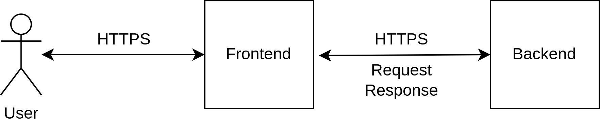

# Intro To Express JS

## What is Express JS?
Express is a minimal and flexible Node.js web application framework that provides a robust set of features for web and mobile applications. It is an open-source framework developed and maintained by the Node.js foundation. Express is used for building web applications and APIs and is the standard server framework for Node.js. 

## Quick Introduction
1. System Overview

2. Folder Structure
```
package.json
index.js
src
├── config
├── controllers
├── middlewares
├── models
└── routes
```

## Steps
1. Install Node.js. You can check if you have Node.js installed by running `node -v` in your terminal. If you don't have Node.js installed, you can download it from the [Node.js website](https://nodejs.org/en/).
2. Create `package.json` file. This file will contain all the necessary information about your project. You can create this file by running `npm init` in your terminal.
3. Install necessary packages. For starter, we need to install a bunch of packages. This can be achieved by typing  `npm install express dotenv body-parser cookie-parser cors mongoose jsonwebtoken morgan` in your terminal.
4. Install nodemon. Nodemon is a utility that will monitor for any changes in your source and automatically restart your server. To install nodemon, you can run `npm install nodemon --save-dev` in your terminal.
5. Customize `package.json` file. You can customize the `package.json` file by adding the following scripts:
```json
"scripts": {
    "start": "node index.js",
    "dev": "nodemon index.js"
}
```
6. Create a new file called `.env` in your project directory. This file will contain all the environment variables for your application.
7. Create a new file called `.gitignore` in your project directory. This file will contain all the files and directories that you want to ignore in your git repository.
8. Create a new file called `index.js` in your project directory. This file will be the entry point of your application.
9. Create a new folder called `src` in your project directory. This folder will contain all the source code of your application.
10. Create a new folder called `config`, `controllers`,  `middlewares`, `models`, `routes` inside the `src` folder. These folders will contain the configuration, controllers, middlewares, models, and routes of your application respectively.

## Additional Information
1. [Postman API Collection](https://www.postman.com/olahsampah-enova/workspace/paw-backend/collection/24138340-4d9ce8cd-810a-4c8e-8d72-58705c108439?action=share&creator=24138340)
2. JSON Web Token (JWT) is not implemented yet. You can implement it by following the [official documentation](https://jwt.io/introduction/).